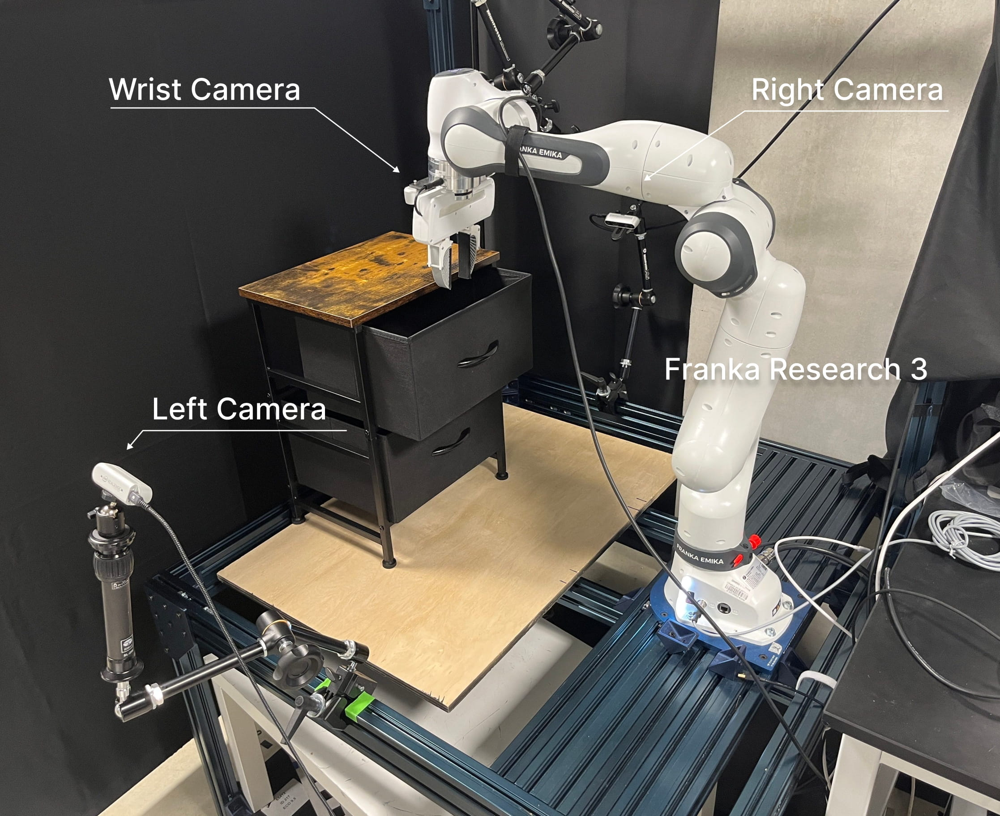

# Sim2Real Transfer

In the experiments from the original paper, we conducted Sim2Real Transfer using the following collected datasets

1. Simulation Data
2. Real Data
3. Co-trained Simulation and Real Data

The original robotic setup uses a Franka Research 3 (note: this has some differences from the Franka Panda), with 3 Intel Realsense Cameras mounted at the wrist, left and right viewing angles.



## Data Collection
### Simulation Data

To generate simulation data from the GenSim2 pipeline, run the following script.
```
python scripts/kpam_data_collection_mp.py --num_pcd 10240 --obs_mode pointcloud --random --asset_id 'random' --nproc 20 --save --num_episodes 100 --dataset "fr3-11task-100eps-10240pcd"
```

Parameters:

- `--num_pcd [INT]`:
Defines the number of point cloud points to generate per observation.
Example: `--num_pcd 10240` generates 10,240 points in each observation.

- `--obs_mode [MODE]`:
Specifies the observation mode for data collection.
Example: `--obs_mode pointcloud` collects point cloud data

- `--random`:
If this flag is provided, the assets will be chosen randomly during the simulation.

- `--asset_id [STRING]`:
Specifies the ID of the asset to use for the simulation. If set to random, a random asset will be chosen.

- `--nproc [INT]`:
Defines the number of processes (parallel workers) to use for data generation. 
Example: `--nproc 20` will use 20 parallel processes.

- `--save`:
If this flag is present, the generated simulation data will be saved.
Example: `--save` saves the collected simulation data.

- `--num_episodes [INT]`:
Specifies the number of episodes to simulate.
Example: `--num_episodes 100` will run 100 simulation episodes.

- `--dataset [STRING]`:
Defines the name of the dataset to be saved. The dataset will be stored using the provided string name.
Example: `--dataset "fr3-11task-100eps-10240pcd"` will name the dataset accordingly

View full list of parameters [here](../scripts/common_parser.py).

Within [scripts/kpam_data_collection_mp.py](../scripts/kpam_data_collection_mp.py), specify in envs the environments to be used. 

```
envs = [
    # Multiinstance, Real
    "OpenBox",
    "CloseBox",
    "OpenLaptop",
    "CloseLaptop",
    "OpenDrawer",
    "PushDrawerClose",
    "SwingBucketHandle",
    "LiftBucketUpright",
    "MoveBagForward",
    "OpenSafe",
    "CloseSafe",
    ...
```

### Real World Data

In real experiments we used a [HTC Vive Controller](https://www.amazon.com/HTC-Vive-Controller-PC/dp/B01LYELB1S) paired with a [HTC Base Station](https://www.amazon.com/HTC-Vive-Base-Station-pc/dp/B01M01B92P/ref=pd_lpo_sccl_2/145-3684974-1143101?pd_rd_w=ueeHo&content-id=amzn1.sym.4c8c52db-06f8-4e42-8e56-912796f2ea6c&pf_rd_p=4c8c52db-06f8-4e42-8e56-912796f2ea6c&pf_rd_r=NK0NRTHE8P8DTAEEW2NG&pd_rd_wg=UvHCf&pd_rd_r=d8e4adb9-0c13-4d33-b736-506a2c3018d0&pd_rd_i=B01M01B92P&psc=1) (no Headset) to collect real-world data. To replicate the setup please refer to [Perceiver-Actor](https://github.com/peract/peract).

The following directory format was used for the dataset. Please refer to `gensim2/agent/dataset/convert_dataset.py` on how to convert real dataset to `TrajDataset` format.

```
gensim2/
│
├── real_dataset/
│   ├── close_box
│       ├── episodes0
│       ├── episodes1
│       ├── ...
│       └── episodes9
│   ├── lift_bucket
        ├── episodes0
│       ├── episodes1
│       ├── ...
│       └── episodes9
│   └── ...
└── ...

```


## Training

Depending on the experiment choose from either of the configs
- Sim/real config `gensim2/agent/experiments/configs/env/gensim2.yaml`
- Co-training config `gensim2/agent/experiments/configs/env/gensim2_cotrain.yaml`

Specify the sim/real/co-train dataset to be used under `domains`.

Modify the training config `gensim2/agent/experiments/configs/config.yaml` to specify whether to train with single type of dataset (sim/real) or co-trained multi-traj dataset. 

```
env: gensim2 # select from gensim2, gensim2_cotrain
```

Specify the name of the run with `suffix` and run

```
python -m agent.run suffix=fr3-100eps-panda-10eps-cotrain-4task
```

## Deployment

Setup will vary depending on robot type.

Please setup calibration for workspace under `gensim2/agent/utils/calibration.py`. Calibration should allow for accurate 3D reconstruction of object. 

After training, run `python -m agent.run_real ` for real-world deployment. Please modify the following according to the setup

- Training config files
- Model Checkpoint
- Realsense Camera Ids

We make use of [Jean Elsner's panda_py](https://jeanelsner.github.io/panda-py/panda_py.libfranka.html),  and multi-processing camera code from [Diffusion Policy](https://github.com/real-stanford/diffusion_policy). 