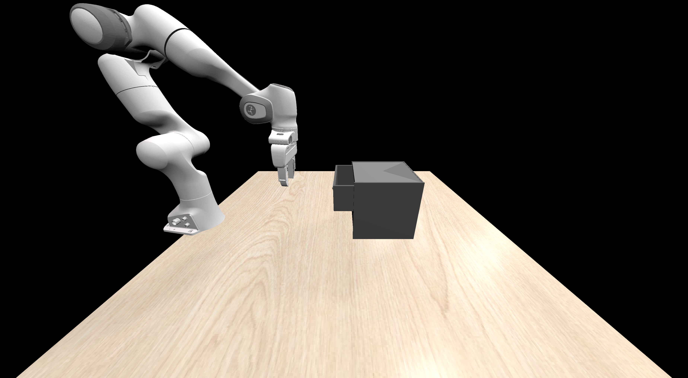
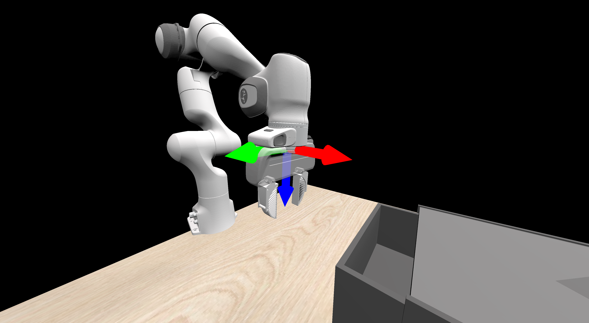
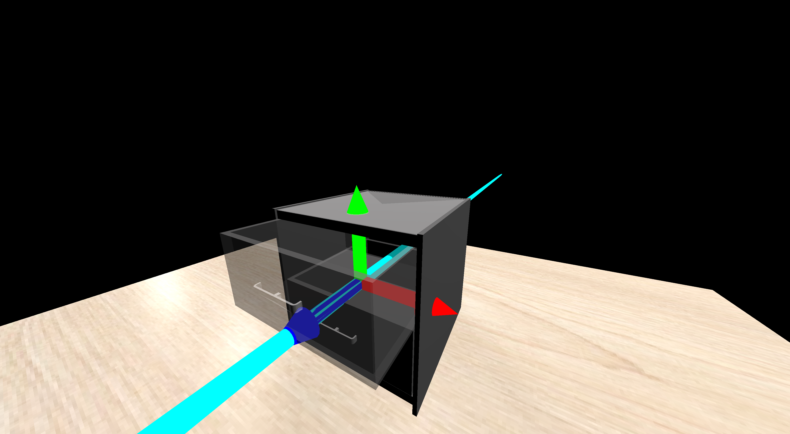
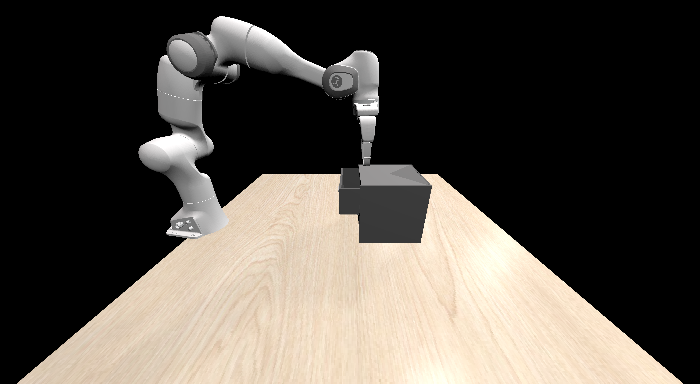
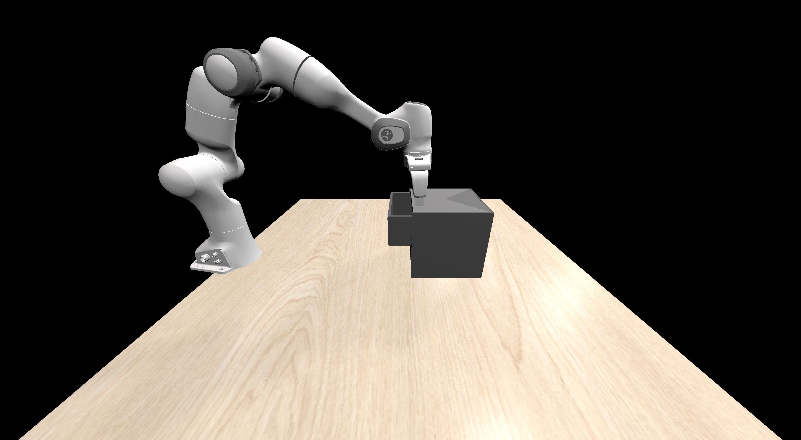
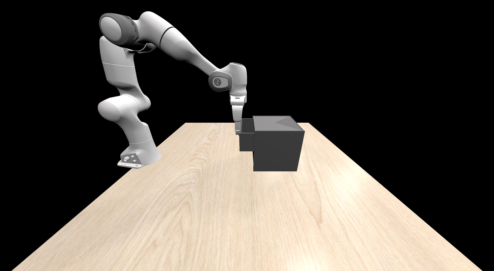
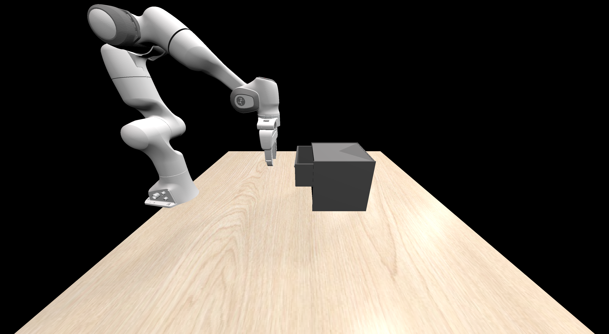

## Solver Creation
Here we will provide a step-by-step tutorial to create a solver for a generated task, with multi-modal LLM and rejection sampling.

Let's take the task "OpenDrawer" as an example.

After you run the task generation script with suitable arguments, you will get a new task with a task dictionary and the corresponding task code.
<details>
<summary><span style="font-weight: bold;">Example Task Description </span></summary>

```python
{
  "task-name": "open-drawer",
  "task-description": "open the drawer using the gripper",
  "assets-used": ["drawer"],
  "success-criteria": ["articulated_open"]
}
```
</details>

<details>
<summary><span style="font-weight: bold;">Example Task Code </span></summary>

```python
import numpy as np
import transforms3d

from gensim2.env.base.base_task import GenSimBaseTask
from gensim2.env.utils.pose import *
from gensim2.env.utils.rewards import *

class OpenDrawer(GenSimBaseTask):
    """Open a drawer."""

    def __init__(self, env, asset_id=""):
        # Define the task description and sub-tasks for clarity.
        self.task_description = "Open a drawer using the gripper."
        self.sub_tasks = ["OpenDrawer"]
        self.sub_task_descriptions = ["Open a drawer"]
        self.success_criteria = ["articulated_open"]
        # For articulated tasks, articulator should be specified, while others should be None.
        # The articulator is the drawer, which is the asset we are manipulating.
        super().__init__(env, articulator="drawer", asset_id=asset_id)

    def reset(self, random=False):
        # Reset the environment to the initial state before starting the task.
        super().reset()

        # If not random, set the drawer to its default closed position and pose.
        # Otherwise, set a random pose and openness for the drawer.
        if not random:
            set_default_openness(self.articulator, self.articulator_name, self.asset_id)
            set_default_pose(self.articulator, self.articulator_name, self.asset_id)
        else:
            set_random_pose(self.articulator, self.articulator_name, self.asset_id, self.task_type)
            set_random_openness(self.articulator, self.articulator_name, self.asset_id)

        # Return the initial observation of the environment after reset.
        return self.env.get_observation()
```
</details>
<br>

Then a Sapien GUI will be launched with the robot arm and objects in the scene. You need to change the view to capture three images for the task by pressing ``p`` : the overall scene (you can use the dafault view of the GUI), the coordinate frame of the robot arm, and the coordinate frame of the object, and press ``q`` to exit. 
As an example, you can capture the following images for task "OpenDrawer". 





After that some constraints will be generated and the corresponding actuation poses will be visualized in the GUI one by one. For those you don't want to use, you can press ``q`` to close the window, while for the one you want to keep, please press ``p`` to capture an image before you exit. Then a question will be asked to confirm the constraint in the terminal as "Does the actuation pose look good?". If you want to keep it, please press ``y``. Otherwise, press ``n``.
<details>
<summary><span style="font-weight: bold;">Example Constraints </span></summary>

```yaml
task_name: OpenDrawer
category_name: Articulated
tool_keypoint_name_list: [tool_head, tool_tail, tool_side]
object_keypoint_name_list: [articulated_object_head]

constraint_list:
- keypoint_name: tool_side
  target_keypoint_name: articulated_object_head
  tolerance: 0.0001
  type: point2point_constraint

- axis_from_keypoint_name: tool_head
  axis_to_keypoint_name: tool_side
  target_axis: [1.0, 0, 0]
  target_axis_frame: object
  tolerance: 0.01
  target_inner_product: 1
  type: frame_axis_parallel

- axis_from_keypoint_name: tool_head
  axis_to_keypoint_name: tool_tail
  target_axis: [0, 0, 1.0]
  target_axis_frame: world
  tolerance: 0.01
  target_inner_product: 1
  type: frame_axis_parallel
```
</details>
<br>


Then the LLM will start to generate pre-actuation motions and post-actuation motions. The motions will be visualized in the GUI. You can press ``q`` to exit the window and answer ``y`` or ``n`` to the question "Does the motion look good?" in the terminal. 

<details>
<summary><span style="font-weight: bold;">Example Pre-actuation Motions </span></summary>

```yaml
task_name: OpenDrawer
category_name: Articulated

# Pre-actuation motions for the manipulator.
# This approach strategy involves moving the gripper diagonally forward and down to reach the actuation pose.
pre_actuation_motions:
  - ["translate_x", 0.1]
  - ["translate_z", -0.1]
```
</details>

<details>
<summary><span style="font-weight: bold;">Example Post-actuation Motions </span></summary>

```yaml
task_name: OpenDrawer
category_name: Articulated

# Post-actuation motions for the manipulator. 
# This sequence plans to pull the drawer open by moving backwards.
post_actuation_motions: ["move-backward"]
```
</details>
<br>

**Pre-actuation motions**





**Post-actuation motions**


<br>
